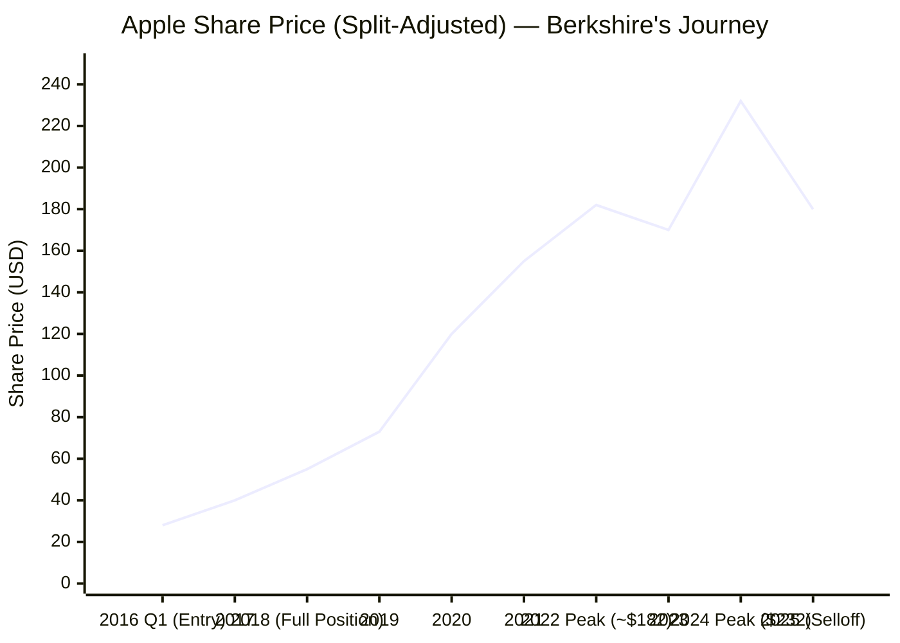
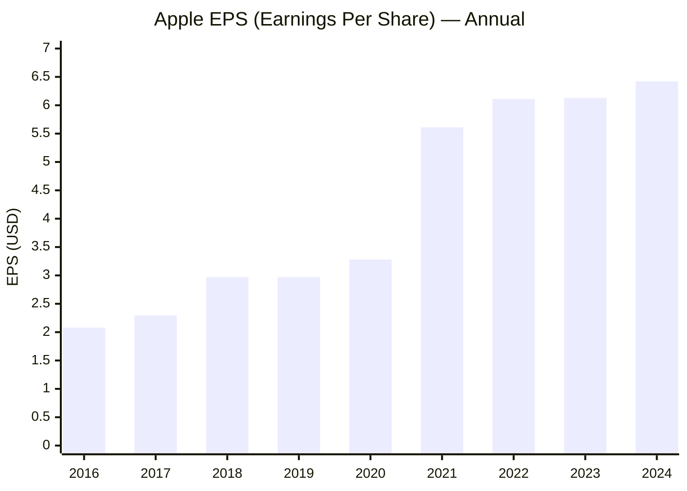
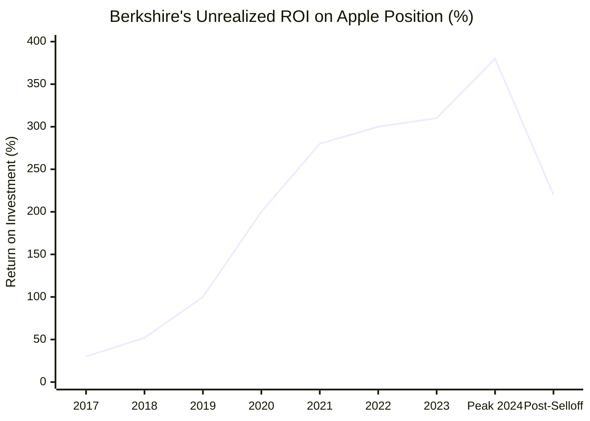
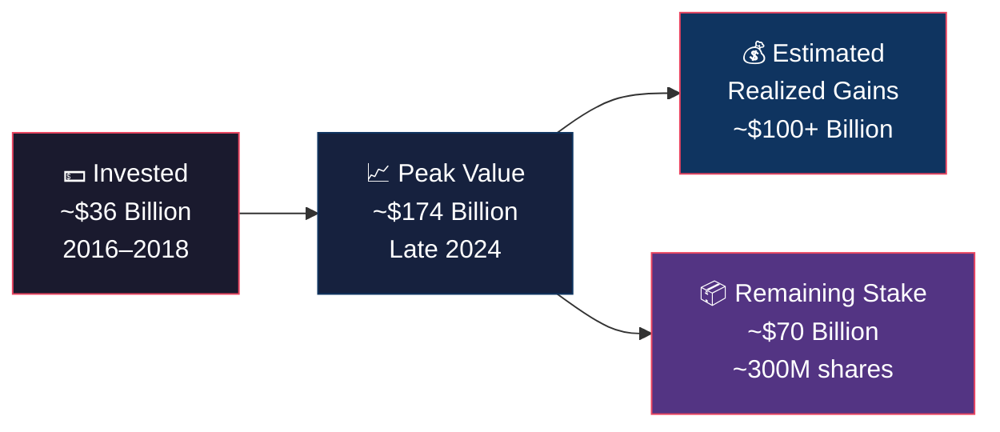

---
categories:
- investment
date: '2026-03-11'
description: Berkshire Apple investment journey
layout: post
title: Berkshire Apple investment summary
toc: true

---

# 🍎 Berkshire & Apple: The Greatest Trade of All Time

> *"Apple is an even better business than I thought it was."*
> — Warren Buffett, 2023

---

## Act I — The Entry (2016–2018): The Old Dog Learns New Tricks

In early **2016**, something remarkable happened. Warren Buffett — the man who famously avoided tech stocks for decades — quietly began buying Apple shares. His lieutenants, Ted Weschler and Todd Combs, nudged him in. He saw not a tech company, but a **consumer products giant with unbreakable loyalty**.

Berkshire began accumulating at an average price of ~**$26–$36/share** (split-adjusted). By mid-2018, they held **~1 billion shares**, investing roughly **$36 billion**.

> *"It's probably the best business I know in the world."*
> — Warren Buffett, 2017

---

## The Price Journey

| Milestone | Year | Approx. Price | Event |
|-----------|------|--------------|-------|
| 🟢 **Entry Begins** | Q1 2016 | ~$28 | First shares purchased |
| 📈 **Position Built** | 2018 | ~$55 | ~1 billion shares held |
| 🚀 **COVID Surge** | 2020 | ~$120 | Work-from-home boom |
| 🏔️ **All-Time Peak** | Late 2024 | ~$232 | Berkshire's peak value: ~$174B |
| 🔴 **Selloff Begins** | 2023–2024 | ~$180 | Buffett trims ~67% of stake |

---

## Act II — The Ascent (2019–2022): Riding the Wave

Apple wasn't just rising — it was **transforming**. Services revenue exploded. The App Store, iCloud, Apple Pay. iPhone loyalty became a moat no competitor could cross.

Berkshire's $36B stake quietly ballooned. By 2021, Apple represented **over 40% of Berkshire's entire equity portfolio** — an almost unthinkable concentration for a value investor.

> *"I don't think of Apple as a stock. I think of it as our third business."*
> — Warren Buffett, 2021

---

## EPS Growth: Why Buffett Held

EPS nearly **tripled** from 2016 to 2024. Every dollar Buffett paid in 2016 was buying into a business that would become 3× more profitable per share. The **buybacks** alone — Apple repurchased hundreds of billions in stock — mechanically boosted EPS year after year.

> *"Tim Cook has been an extraordinary CEO... Apple's repurchase of its shares has been a huge plus for us."*
> — Warren Buffett, 2023 Annual Letter

---

## ROI Over Time: The Scoreboard

---

## Act III — The Peak & The Exit (2023–2024): Buffett Cashes In

At its height, Berkshire's Apple stake was worth **~$174 billion** — on a ~$36B investment. A return of roughly **$138 billion in profit**.

Then, quietly, Buffett began selling. Not all at once — but methodically. By end of 2024, Berkshire had reduced its position by approximately **67%**, from ~915 million shares to ~300 million shares.

Why? Buffett cited:
- **Elevated valuations** (P/E above 30×)
- **Tax reasons** — locking in gains at current capital gains rates
- **Building the cash fortress** — Berkshire's cash hit a record **$325 billion**

---

## The Final Tally

| | Amount |
|---|---|
| **Total Invested** | ~$36 billion |
| **Peak Portfolio Value** | ~$174 billion |
| **Estimated Realized Gains (sold shares)** | ~$100 billion |
| **Remaining Stake Value** | ~$70 billion |
| **Total Profit (realized + unrealized)** | **~$138 billion** |
| **Overall ROI** | **~383%** |

---

## Epilogue: What Made This Trade Legendary

It wasn't luck. It was Buffett recognizing that Apple's **ecosystem lock-in** was the most powerful moat since Coca-Cola. The consumer loyalty, the buyback machine, the services flywheel — all compounded silently.

The selloff wasn't a loss of faith. It was **capital discipline** at historic scale.

> *"When you find a truly wonderful business, you don't think about selling it."*
> — Warren Buffett

*And when you do sell — you make $100 billion.*

---

*Data based on publicly reported 13-F filings, Berkshire annual letters, and Apple financial reports. Prices are split-adjusted. All figures approximate.*
