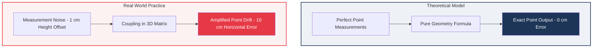
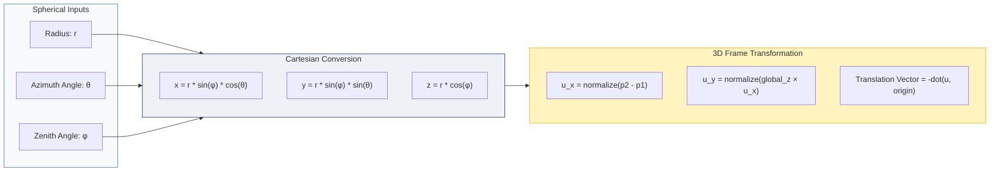
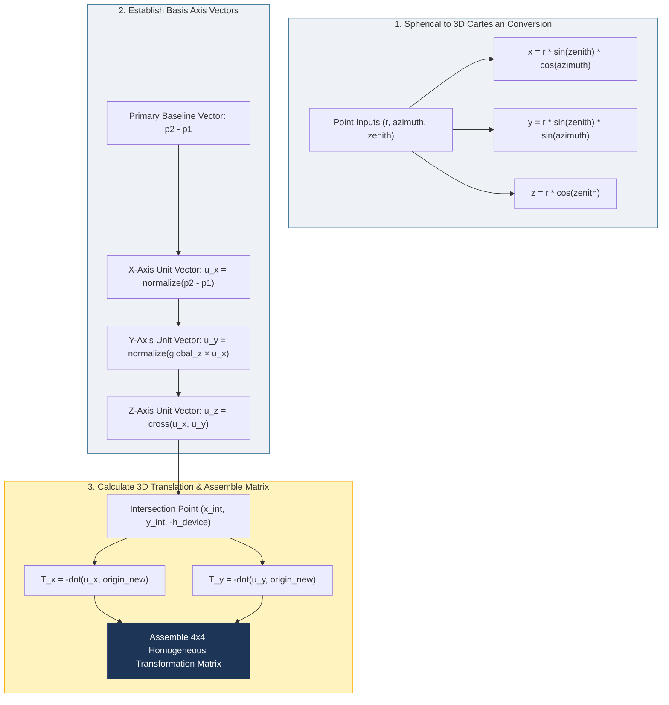
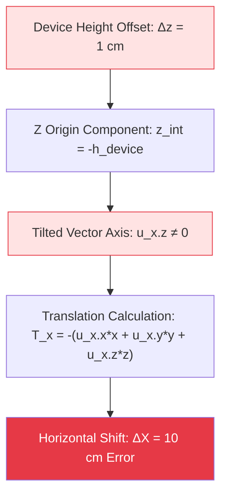
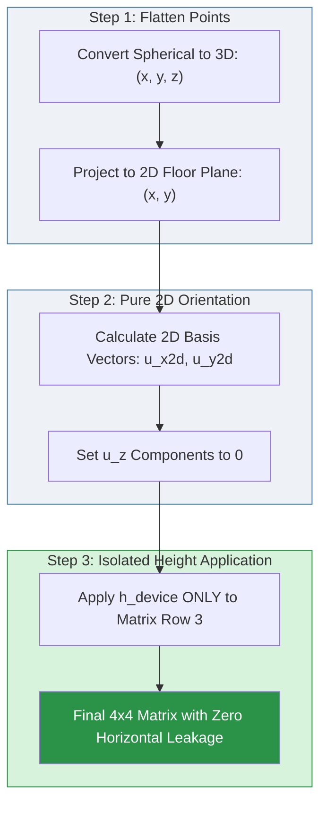

---
categories:
- robotics
date: '2026-08-12'
description: A explanation of how theoretical formulas has to be changed as per realistic sensor data
layout: post
title: Theory vs. Practice in 3D Point Transformation
toc: true

---
# Theory vs. Practice in 3D Point Transformation

*How Small Measurement Errors Cause Large Calculation Errors in Real World Applications*

I had to implement a simple Horizontal coordinate(elevation,azimuth,distance) to cartesian cordinate(x,y,z) convertor . Which is a simple matrix multiplication.
I implemented it and was working perfectly in most cases until it was not working in some cases. 
In further debugging you find series of problems on how a small error in some readings causes 10 times big error in the final output. 
This blog is a summary on how you can still remove these errors by putting some checks and conversion.

---

## 1. Introduction: Theory vs. Practice

Mathematical formulas work in clean environments. Perfect formulas assume perfect inputs. In theory, if you measure three points on room walls, pure geometry calculates exact 3D point transformations.

Real environments are not clean. Physical tools always have measurement noise. Human operators introduce small offsets. When real measurement errors go into theoretical formulas, the math amplifies these small errors into large calculation failures.

---

## 2. The Original Solution: Real-World Error Analysis

The original process converts spherical point coordinates $(r, \theta, \phi)$ to 3D Cartesian coordinates $(x, y, z)$. It uses three measurement points:

* **Point A & Point B:** Measured on Wall 1 to establish the baseline orientation.
* **Point C:** Measured on a perpendicular wall to establish the room alignment.

Here is the expanded **Original Solution: Matrix Generation & Real-World Error Analysis** section with detailed text and diagrams explaining how the 3D transformation matrix is constructed and why real-world measurement noise breaks it.

---

## 2. The Original Solution: Matrix Generation & Error Analysis

The original system converts spherical point measurements $(r, \text{azimuth}, \text{zenith})$ into Cartesian 3D coordinates $(x, y, z)$. It uses three reference targets:

* **Point A & Point B:** Measured along Wall 1 to define the main horizontal orientation axis.

* **Point C:** Measured on a perpendicular wall to locate the room origin.

### Step-by-Step 3D Transformation Matrix Generation

To align all measured points with the room geometry, the original math constructs a **4x4 Homogeneous Transformation Matrix** using the following steps:

1. **Vector Orientation ($u_x, u_y, u_z$):**
The primary axis $u_x$ is derived directly by subtracting 3D Point A from 3D Point B. $u_y$ is created using the cross product of the global Z vector $(0, 0, 1)$ and $u_x$. $u_z$ is the cross product of $u_x$ and $u_y$.

2. **Intersection Point ($x_{\text{int}}, y_{\text{int}}, -h_{\text{device}}$):**
The math projects lines from $p_1 \to p_2$ and from $p_3$ perpendicularly to find where wall alignment lines intersect on the floor plane. The device height ($h_{\text{device}}$) is applied to set $z_{\text{origin}} = -h_{\text{device}}$.

3. **3D Dot Product Translation Matrix:**
Translations $T_x$ and $T_y$ are calculated using full 3D dot products between the direction unit vectors ($u_x, u_y$) and the origin vector

$$T_x = -(u_{x.x} \cdot x_{\text{int}} + u_{x.y} \cdot y_{\text{int}} + u_{x.z} \cdot z_{\text{int}})$$

$$T_y = -(u_{y.x} \cdot x_{\text{int}} + u_{y.y} \cdot y_{\text{int}} + u_{y.z} \cdot z_{\text{int}})$$

$$\text{Original Matrix} = \begin{bmatrix}  u_{x.x} & u_{x.y} & u_{x.z} & T_x \\  u_{y.x} & u_{y.y} & u_{y.z} & T_y \\  0 & 0 & 1 & h_{\text{device}} \\  0 & 0 & 0 & 1  \end{bmatrix}$$

---

### Problem 1: Height Offset Leakage into Horizontal Coordinates

The device height ($h_{\text{device}}$) sets the Z-axis origin position: $z_{\text{origin}} = -h_{\text{device}}$. The original mathematical formula projects full 3D vector dot products into X and Y coordinate translations:

$$T_x = -(u_{x.x} \cdot x_{\text{int}} + u_{x.y} \cdot y_{\text{int}} + u_{x.z} \cdot z_{\text{int}})$$

$$T_y = -(u_{y.x} \cdot x_{\text{int}} + u_{y.y} \cdot y_{\text{int}} + u_{y.z} \cdot z_{\text{int}})$$

When Wall 1 points are not perfectly level, $u_{x.z}$ is not zero. Therefore, $z_{\text{origin}}$ directly changes the horizontal $T_x$ and $T_y$ position values.

---

### Problem 2: Angle Amplification over Distance

A measurement tool calculates points using radius distance $r$ and zenith angle $\phi$:

$$z = r \cdot \cos(\phi) \quad \text{and} \quad d_{\text{horizontal}} = r \cdot \sin(\phi)$$

When a target point is far from the device (for example, $r = 10\text{ m}$), a small vertical error changes the effective zenith angle. The long distance acts as a leverage arm, amplifying a 1 cm height error into a 10 cm horizontal error.

---

## 3. Measurement Sensitivity Table

| Measurement Input | Real World Error | Primary Affected Matrix Axis | Final Output Error |
| --- | --- | --- | --- |
| **Device Height ($h_{\text{device}}$)** | $\pm 1.0\text{ cm}$ offset | Z-axis coupled into X-Y Translation | **$10.0\text{ cm}$ point position drift** |
| **Point A / B Zenith Angle** | $\pm 0.25^\circ$ sensor tilt | $u_{x.z}$ vertical vector component | $4.5\text{ cm}$ tilt error over $5\text{ m}$ distance |
| **Point A to B Baseline Distance** | Points closer than $0.5\text{ m}$ | $u_x$ orientation unit vector | Severe angular drift across entire room |

---

## 4. The Robust Updated Solution

The updated solution decouples vertical height calculations from horizontal calculations using a pure 2D planar projection before constructing the transformation matrix.

---

### How the Robust Solution Fixes the Problems

1. **Zero Horizontal Leakage:** The rotation vectors $u_{x2d}$ and $u_{y2d}$ have explicit Z values of zero ($u_z = 0$). Device height offset only affects the output Z axis.
2. **Baseline Validation Guard:** The system checks baseline distance: $d = \sqrt{dx^2 + dy^2}$. If $d < 0.5\text{ m}$, calculation stops to prevent extreme sensitivity.
3. **Singularity Protection:** The code checks vertical conditions ($dx \approx 0$) and horizontal conditions ($dy \approx 0$) directly to prevent division by zero.

---

## 5. Mathematical Matrix Comparison

### Original Matrix (Coupled Errors):

$$M_{\text{original}} = \begin{bmatrix} u_{x.x} & u_{x.y} & u_{x.z} & T_x(z) \\ u_{y.x} & u_{y.y} & u_{y.z} & T_y(z) \\ 0 & 0 & 1 & h_{\text{device}} \\ 0 & 0 & 0 & 1 \end{bmatrix}$$

### Robust Matrix (Decoupled Height):

$$M_{\text{robust}} = \begin{bmatrix} u_{x2d.x} & u_{x2d.y} & 0 & T_{x2d} \\ u_{y2d.x} & u_{y2d.y} & 0 & T_{y2d} \\ 0 & 0 & 1 & h_{\text{device}} \\ 0 & 0 & 0 & 1 \end{bmatrix}$$
